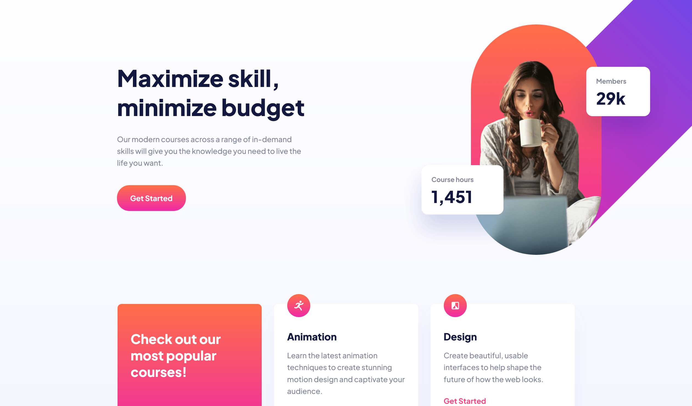

# Frontend Mentor - Skilled e-learning landing page solution

This is a solution to the [Skilled e-learning landing page challenge on Frontend Mentor](https://www.frontendmentor.io/challenges/skilled-elearning-landing-page-S1ObDrZ8q).

## Table of contents

- [Overview](#overview)
  - [The challenge](#the-challenge)
  - [Screenshot](#screenshot)
  - [Links](#links)
- [My process](#my-process)
  - [Built with](#built-with)
  - [What I learned](#what-i-learned)
  - [Useful resources](#useful-resources)
- [Author](#author)

## Overview

### The challenge

Users should be able to:

- View the optimal layout depending on their device's screen size
- See hover states for interactive elements

### Screenshot



### Links

- Solution URL: [Add solution URL here](https://your-solution-url.com)
- Live Site URL: [Add live site URL here](https://your-live-site-url.com)

## My process

### Built with

- Semantic HTML5 markup
- CSS custom properties
- Flexbox
- CSS Grid
- Mobile-first workflow

### What I learned

I tried to use more advanced CSS in this project so I used:

- `clamp() function` - thanks to this function, all fonts are smooth depending on the width of the screen
- `fluid grid layout` - there was no need to create a media query for main section
- `:is selector` - helped me select a specific button depending on where it was located

Here's some code snippets:

```css
h1 {
  font-size: clamp(2.5rem, 0.7222rem + 3.7037vw, 3.5rem);
}

.main-content {
  display: grid;
  row-gap: 1rem;
  column-gap: 4rem;
  grid-template-columns: repeat(auto-fill, minmax(330px, 1fr));
}

:is(footer) .btn {
  background: var(--gradient-dark);
}
```

### Useful resources

- [CSS Grid](https://css-tricks.com/snippets/css/complete-guide-grid/) - This helped me with CSS Grid (especially, with making my grid more fluid)
- [Clamp()](https://xgkft.csb.app/) - This is an amazing app which helped me with the CSS clamp() function

## Author

- Website - [J.Walczak](https://github.com/jwalczak94)
- Frontend Mentor - [@jwalczak94](https://www.frontendmentor.io/profile/jwalczak94)
